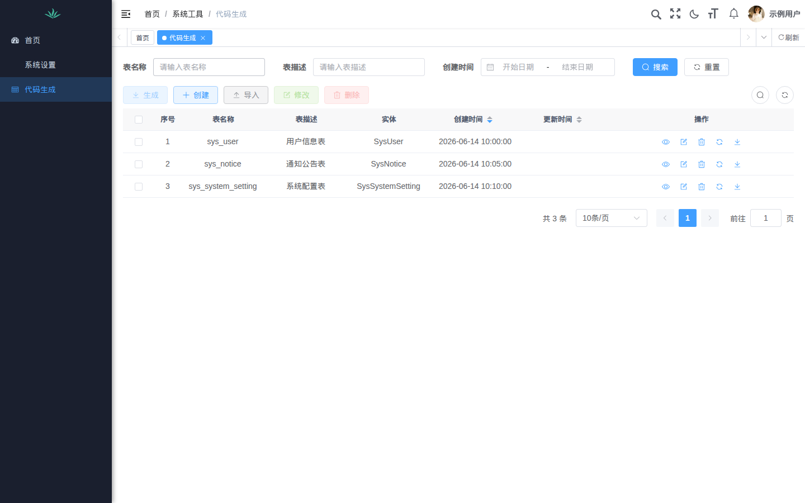

# RuoYi-Go BY

一个基于 Go、Gin、GORM 和 Vue 3 的 RuoYi 风格后台管理系统示例。

本仓库是一个可独立运行的开源代码副本，默认配置仅用于本地开发。部署前请修改数据库、Redis、JWT 密钥和所有默认账号配置。

## 当前源码与下载版本

当前原生若依主线稳定版本为 [v1.1.3](https://github.com/touensan/ruoyi-go-by/releases/tag/v1.1.3)，包含统一后台 RBAC 和能力状态修正。v1.2.0–v1.4.0 是 Whiteyun 历史支线，版本号较大但不代表当前主线；完整对应关系见 [版本与下载状态](docs/VERSIONS.md)。

## 统一后台

本项目与 `ruoyi-xxx-by` 系列统一采用单一后台和 RBAC 权限模型，不拆分用户端、管理端。菜单、路由、页面和接口随角色授权动态控制；管理员继承普通用户基础权限，并叠加管理权限。详见 [架构与权限约定](docs/ARCHITECTURE.md)。

## 技术栈

- 后端：Go 1.25+、Gin、GORM、MySQL、Redis、JWT、excelize
- 前端：Vue 3、Vite、TypeScript、Element Plus、Pinia、Vue Router、Axios

## 功能差异

在 RuoYi 基础能力之外，本项目重点补充了以下后台功能：

- **聚合系统配置**：在一个后台入口中提供站点、支付和邮箱三个配置标签页，支持 SEO、版权、Logo、备案和客服信息维护。
- **支付配置与测试**：支持易支付 V1/V2，使用复选框配置支付宝和微信支付，并提供回调地址生成和功能测试入口；示例配置不包含任何商户密钥。
- **邮箱配置与测试**：支持 SMTP、QQ 邮箱、Gmail 和自定义服务器，提供邮件发送测试，同时默认不填写任何真实凭据。
- **数据库结构查看**：提供真实数据表与列结构查询；完整代码生成、生成配置保存和生成下载尚未实现，相关接口明确返回 501。
- **Go 原生运行**：后端以单个 Go 服务运行，保留 MySQL、Redis、JWT、文件上传和常见系统管理能力。

功能边界见 [FEATURES.md](docs/FEATURES.md)：支付网关测试不等于订单入账，定时任务、公告持久化及完整代码生成尚未实现。

## 界面预览

以下截图使用 Chromium 在本地脱敏前端和演示数据生成，不包含生产账号或真实业务数据。截图展示界面结构，不代表所有按钮背后的能力已实现；以功能范围中的后端状态为准。

### 后台首页


### 系统设置


### 支付配置


### 代码生成



## 后端运行

Release 包已包含 Linux x86_64 后端和构建后的前端。下载 `ruoyi-go-by-v1.1.3-linux-x86_64.tar.gz` 与 `SHA256SUMS` 校验后，复制并修改 `application-example.yaml` 即可准备运行。源码方式按下列步骤构建。

```bash
cp application-example.yaml application.yaml
# 编辑 application.yaml，填写本地数据库和 Redis 配置
go mod tidy
go run main.go
```

## 前端运行

```bash
cd frontend/RuoYi-Vue3-ts
cp .env.example .env.development
npm install
npm run dev
```

## 构建

```bash
go build -o ruoyi-go-by main.go
cd frontend/RuoYi-Vue3-ts
npm run build:prod
```

## 数据库

`ruoyi.sql` 包含表结构和本地开发所需的示例初始化数据。示例账号为 `admin`，密码为 `change-me-before-production`，首次登录后必须立即修改。请不要把真实用户、支付、邮件或生产配置写入 SQL 文件。

## 安全说明

- `application.yaml` 已被 Git 忽略，请勿提交。
- 生产环境必须替换示例 JWT 密钥、数据库密码、Redis 密码和默认账号密码。
- 发现安全问题请参考 [SECURITY.md](SECURITY.md)。

## 许可证

本项目使用 MIT License。第三方依赖仍以各自许可证为准。
