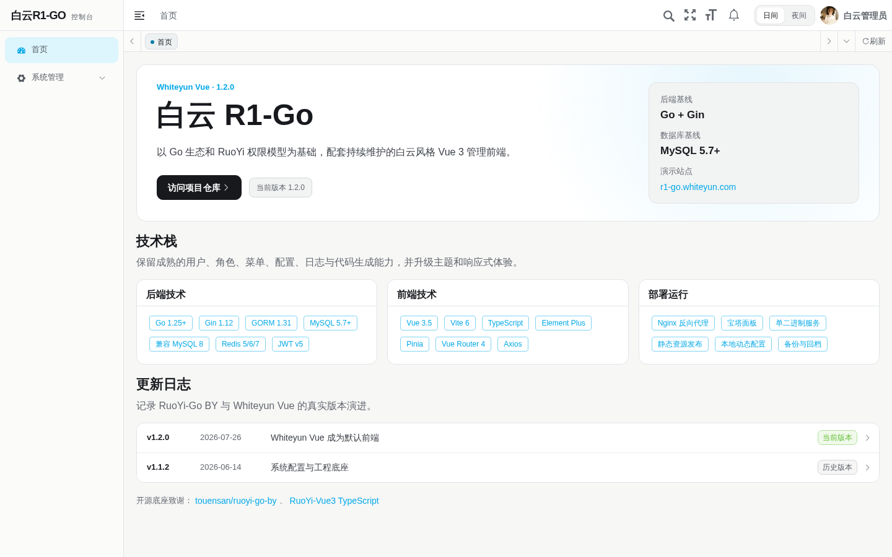
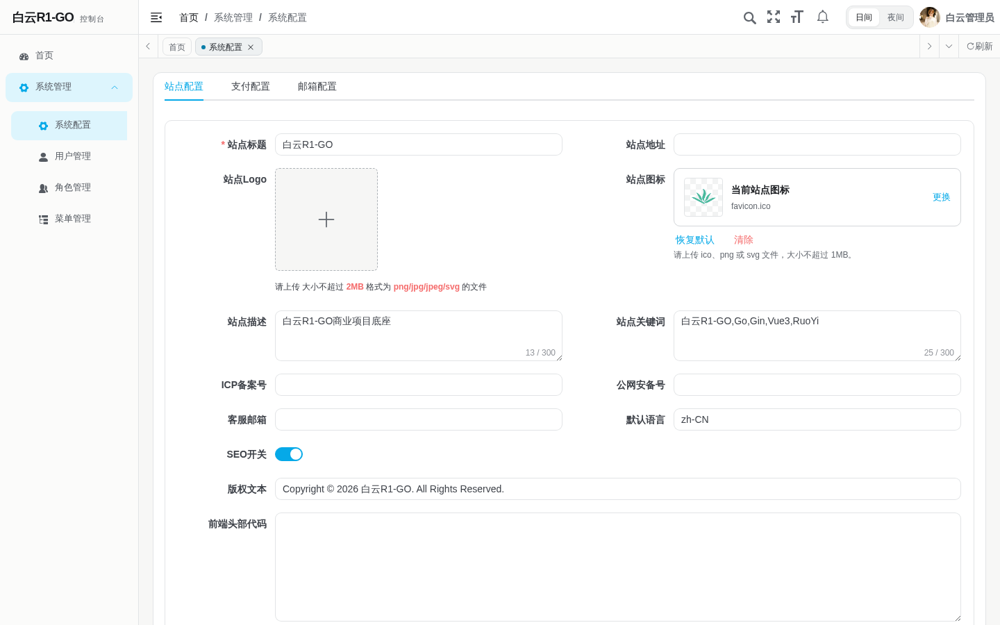
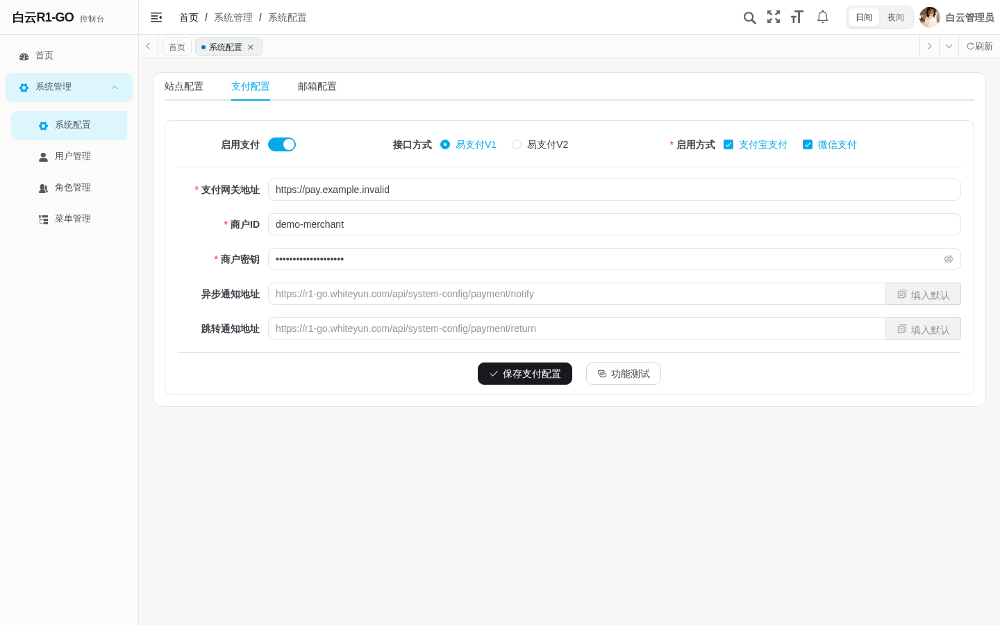
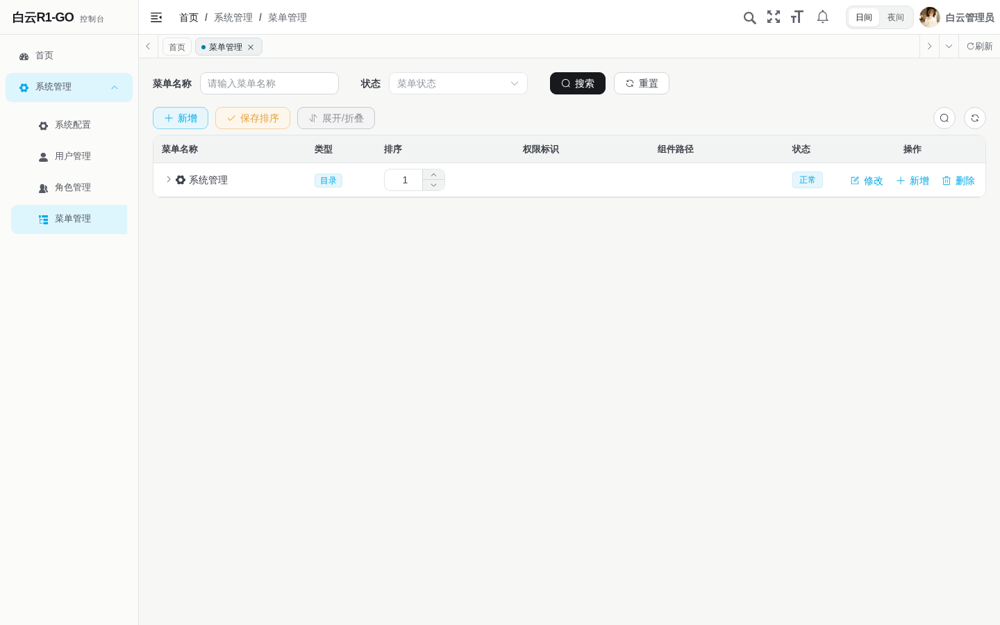

# RuoYi-Go BY

一个基于 Go、Gin、GORM 和 Vue 3 的 RuoYi 风格后台管理系统示例。

本仓库是一个可独立运行的开源代码副本，默认配置仅用于本地开发。部署前请修改数据库、Redis、JWT 密钥和所有默认账号配置。

管理端现已默认使用 `Whiteyun Vue`（白云风格前端）。原有 `RuoYi Vue`
仍保留在仓库中供旧项目兼容选择，但后续功能、适配和视觉更新只维护
`Whiteyun Vue`。

## 技术栈

- 后端：Go 1.25+、Gin、GORM、MySQL 5.7+（兼容 MySQL 8）、Redis、JWT、excelize
- 默认前端：Whiteyun Vue、Vue 3、Vite、TypeScript、Element Plus、Pinia、Vue Router、Axios
- 兼容前端：RuoYi Vue，仅保留旧视觉与旧二次开发兼容

## 功能差异

在 RuoYi 基础能力之外，本项目重点补充了以下后台功能：

- **聚合系统配置**：在一个后台入口中提供站点、支付和邮箱三个配置标签页，支持 SEO、版权、Logo、备案和客服信息维护。
- **支付配置与测试**：支持易支付 V1/V2，使用复选框配置支付宝和微信支付，并提供回调地址生成和功能测试入口；示例配置不包含任何商户密钥。
- **邮箱配置与测试**：支持 SMTP、QQ 邮箱、Gmail 和自定义服务器，提供邮件发送测试，同时默认不填写任何真实凭据。
- **代码生成工作台**：提供数据表筛选、导入、预览、同步、生成和下载入口，前端使用 Element Plus 管理界面。
- **Go 原生运行**：后端以单个 Go 服务运行，保留 MySQL、Redis、JWT、文件上传和常见系统管理能力。

## 界面预览

以下截图来自 [白云 R1-Go 演示站](https://r1-go.whiteyun.com/)，截图中的支付字段已脱敏，不包含生产账号、密钥或真实业务数据。

### 后台首页



### 系统设置



### 支付配置



### 菜单管理



## 后端运行

```bash
cp application-example.yaml application.yaml
# 编辑 application.yaml，填写本地数据库和 Redis 配置
go mod tidy
go run main.go
```

## 前端运行

默认使用持续维护的 Whiteyun Vue：

```bash
cd frontend/whiteyun-vue
cp .env.example .env.development
npm ci
npm run dev
```

需要旧若依视觉时，可改用 `frontend/ruoyi-vue`。两套前端的定位和构建方式见
[frontend/README.md](frontend/README.md)。

## 构建

```bash
go build -o ruoyi-go-by main.go
frontend/build-admin.sh
```

如需构建冻结的旧版前端：

```bash
APIAUTH_ADMIN_FRONTEND=ruoyi-vue frontend/build-admin.sh
```

## 数据库

`ruoyi.sql` 包含表结构和本地开发所需的示例初始化数据。示例账号为 `admin`，密码为 `change-me-before-production`，首次登录后必须立即修改。请不要把真实用户、支付、邮件或生产配置写入 SQL 文件。

## 安全说明

- `application.yaml` 已被 Git 忽略，请勿提交。
- 生产环境必须替换示例 JWT 密钥、数据库密码、Redis 密码和默认账号密码。
- 发现安全问题请参考 [SECURITY.md](SECURITY.md)。

## 许可证

本项目使用 MIT License。第三方依赖仍以各自许可证为准。
